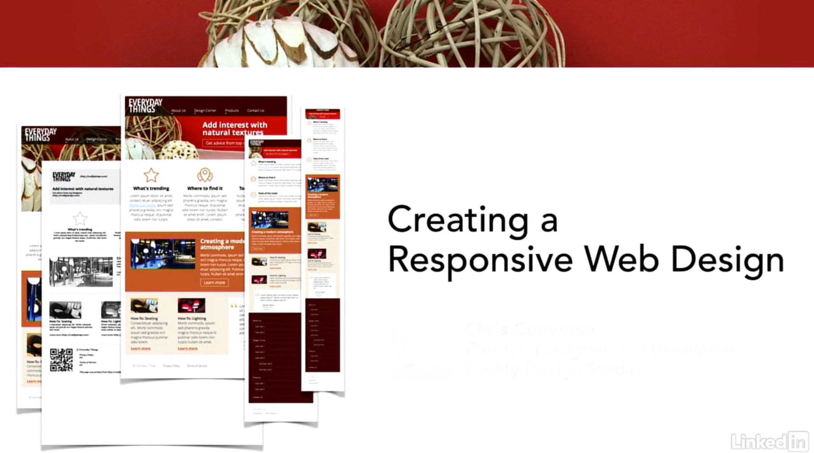

# [Creating A Responsive Web Design](https://www.lynda.com/CSS-tutorials/Creating-Responsive-Web-Design/424046-2.html)

Discover how to use responsve web design to make your site more readable and efficient on any device. This course takes the site from start to finish, from setting up the HTML page and containers to styling established elements for small, medium, and large screens. Along the way, we'll learn how to reposition the nav bar for better viewing on mobile devices, create animated transitions, and turn bulleted lists into interactive menus with full touch support. Plus, learn how to use CSS pseudo-elements and adapt layouts for print to save ink and paper.

Topics include:
- Planning your layout
- Creating HTML containers, content and links
- Creating and styling the layout with CSS
- Creating a menu system
- Styling headings, body text, and footers
- Styling and repositioning navigation links
- Swapping high-resolution graphics for Retina displays
- Making sure content is printable

